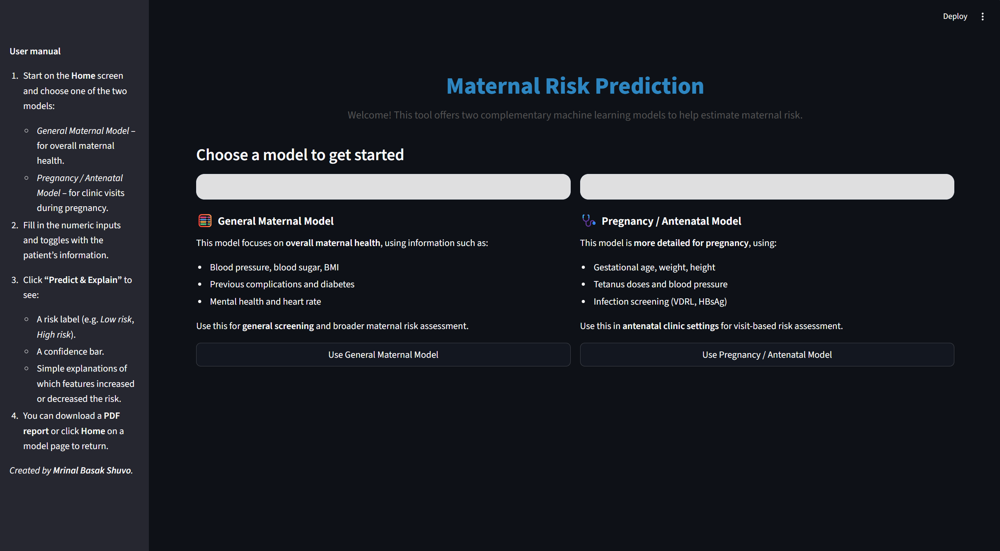
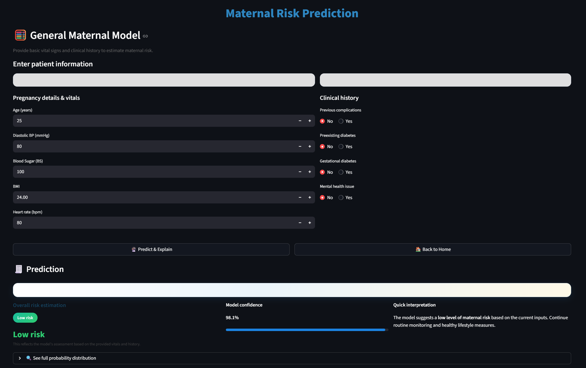
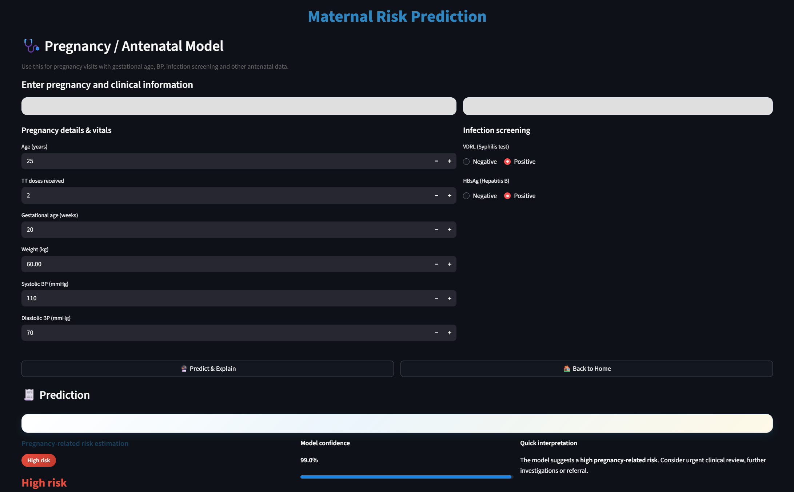
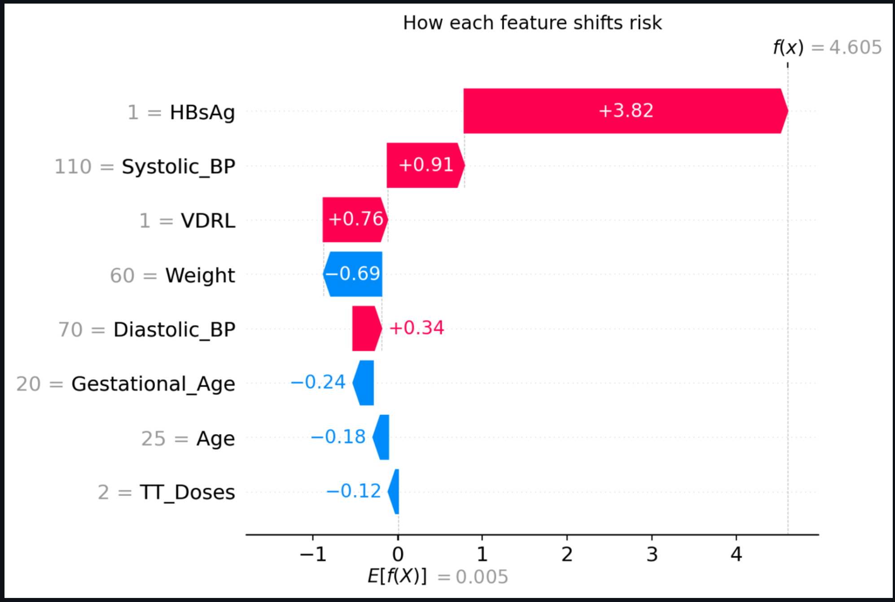

# 🩺 Maternal Risk Prediction App

A Streamlit-based machine learning web application for predicting **maternal health risk** and **pregnancy (antenatal) risk** using clinically relevant features.  
This tool helps health professionals assess patient status and understand *why* the model made a particular prediction through clear SHAP explanations.

---

## 🌟 Features

### 🔮 **Two Machine Learning Models**
1. **General Maternal Model**
   - Uses vitals and clinical history (BMI, Blood Sugar, complications, diabetes, etc.)
   - Outputs: Low / Moderate / High Risk
   - SHAP-based interpretability

2. **Pregnancy / Antenatal Model**
   - Uses gestational age, TT doses, infection markers, BP, and vitals
   - Outputs: Low / Moderate / High Risk
   - SHAP-based interpretability

---

## 🧠 Explainability (XAI)

Every prediction includes:

- Feature impact **Bar Plot**
- **Waterfall Plot** showing how each feature shifts the risk up or down
- Top 3 contributing factors explained in plain language
- Easy-to-understand interpretation showing what increased or decreased risk

---

## 📄 PDF Report Generation

The app produces a polished PDF report including:

- Color-coded **risk label**
- Model confidence
- Probabilities for each class
- Top SHAP feature contributions
- All input values used for the prediction
- ⚠ **High-risk warning** — advising the patient to consult a doctor immediately

---

## 📸 Screenshots

Below are some key screens from the application:

### 🏠 Home Page


### 🧮 General Maternal Model


### 🩺 Clinical / Pregnancy Model


### 🧠 SHAP Waterfall (Explainability)


### 📄 PDF Report (Preview)


---

## 🚀 Deployment on Streamlit Cloud

You can deploy this project easily using Streamlit Cloud:

1. Push the repository to GitHub  
2. Visit: https://share.streamlit.io  
3. Click **New App**
4. Choose:
   - Repository: `mbs57/maternal-risk-prediction`
   - Branch: `main`
   - Main file: `app.py`
5. Deploy 🎉

Streamlit Cloud automatically:
- Installs dependencies from `requirements.txt`
- Launches your app
- Gives you a shareable public URL

---
## 📁 Project Structure
maternal-risk-prediction/
│
├── app.py # Main entry point for Streamlit app
├── utils.py # Helper utilities and PDF generation
├── home_page.py # Home screen UI logic
├── general_model_page.py # General maternal model logic/UI
├── pregnancy_model_page.py # Pregnancy/antenatal model logic/UI
│
├── best_xgbc_model2.pkl # Pregnancy model (8 features)
├── best_xgbc_model3.pkl # General maternal model
│
├── images/ # UI screenshots used in README
│ ├── Home.png
│ ├── General_Model.png
│ ├── Clinical_Model.png
│ ├── Waterfall.png
│ └── PDF_Report.png
│
├── requirements.txt # Python dependencies
└── README.md # Project documentation


---

## 🛠 Installation & Requirements

Install all dependencies using:

```bash
pip install -r requirements.txt
```
#### Main libraries used

Streamlit – UI framework

NumPy – numerical operations

XGBoost – machine learning models

SHAP – model explainability

Matplotlib – plots

ReportLab – PDF generation

Scikit-learn – preprocessing & utilities

🤖 Models

Two offline-trained XGBoost models are included:

Pregnancy Model

8 carefully selected antenatal features

Optimized for clinical screening in antenatal care

General Maternal Model

Includes vitals, clinical history, and diabetes indicators

Designed for general health risk assessment

Both models load automatically when the application starts.

👤 Author

Mrinal Basak Shuvo
Student • Developer • ML Enthusiast
GitHub: https://github.com/mbs57

⚠ Disclaimer

This tool is intended for decision support only.
It is not a medical diagnostic system.
Any high-risk prediction should be followed by immediate consultation with a qualified healthcare professional.
